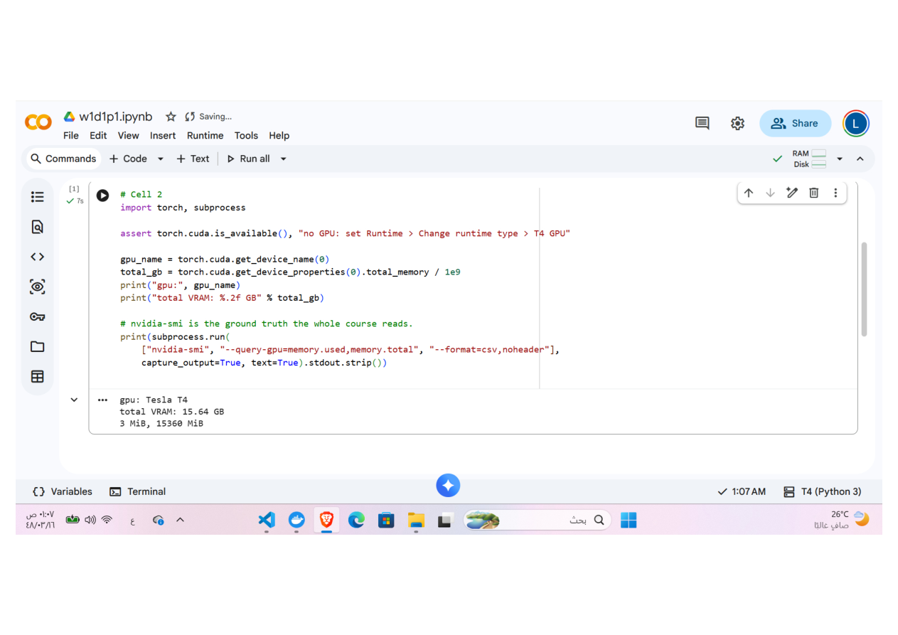
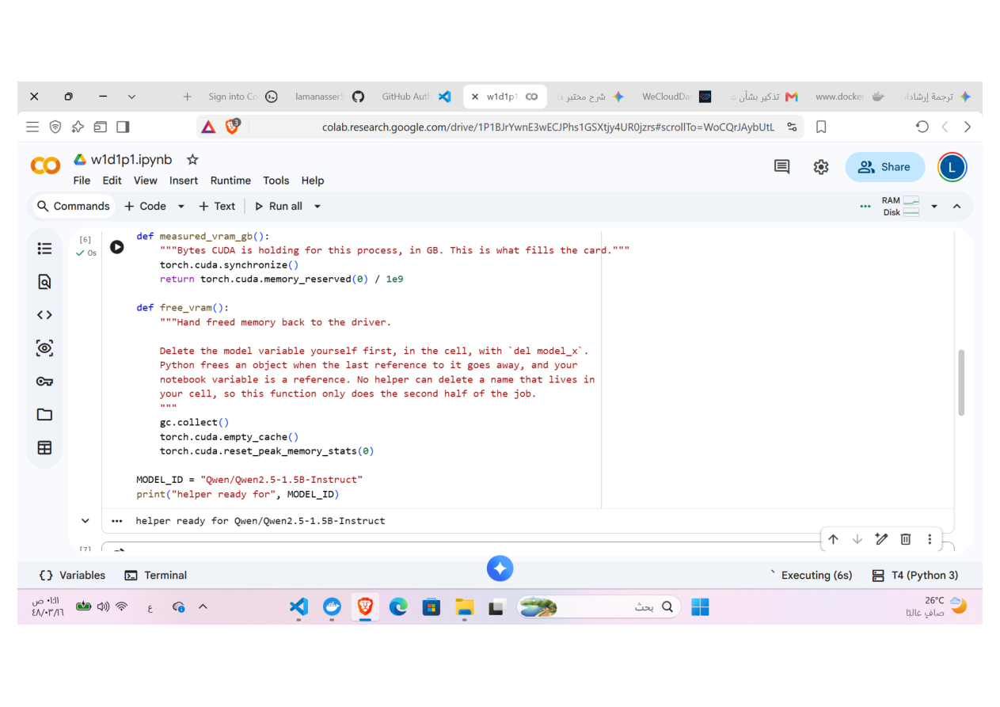
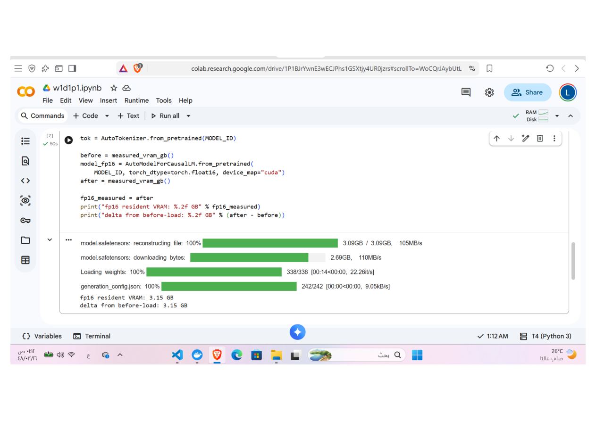
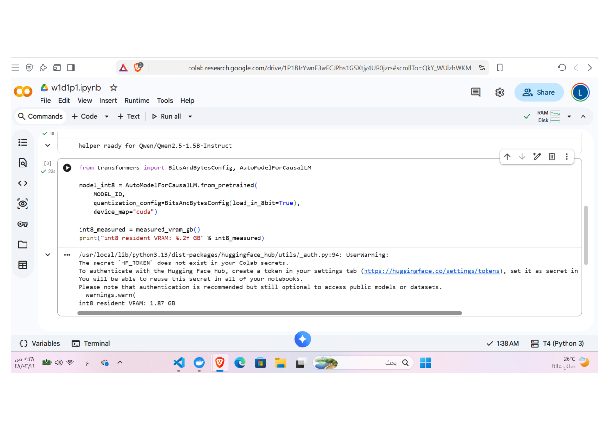
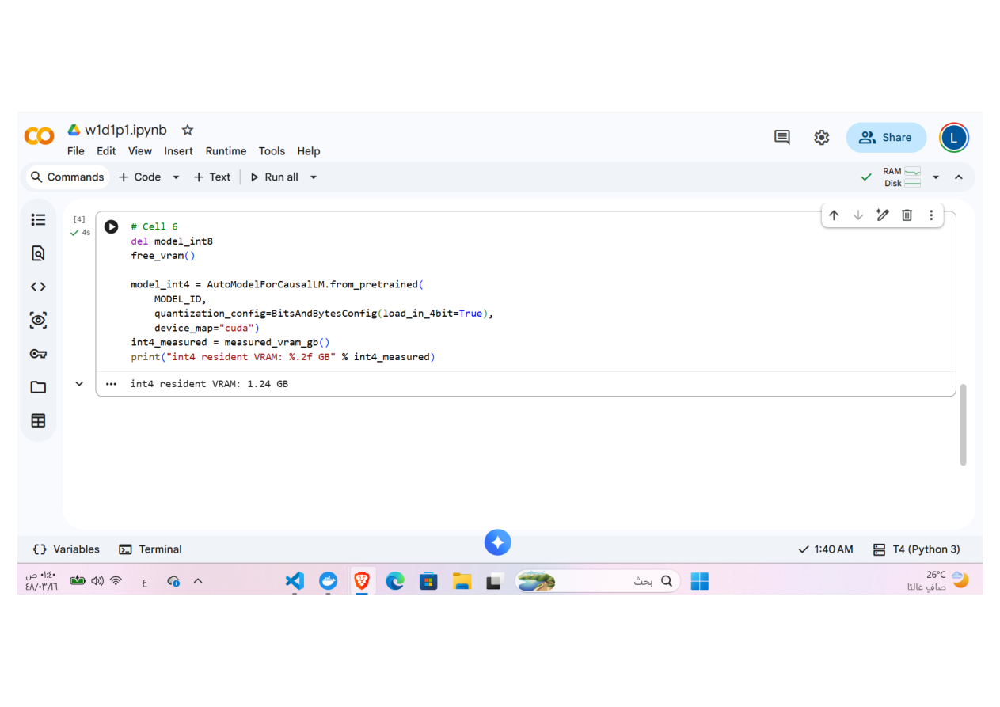
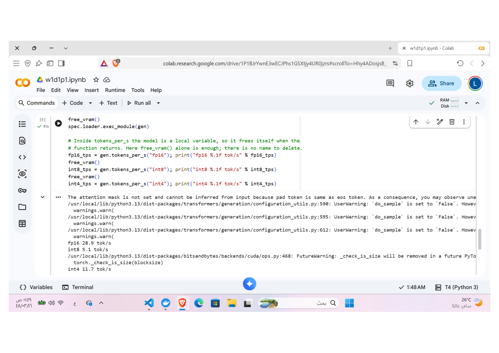
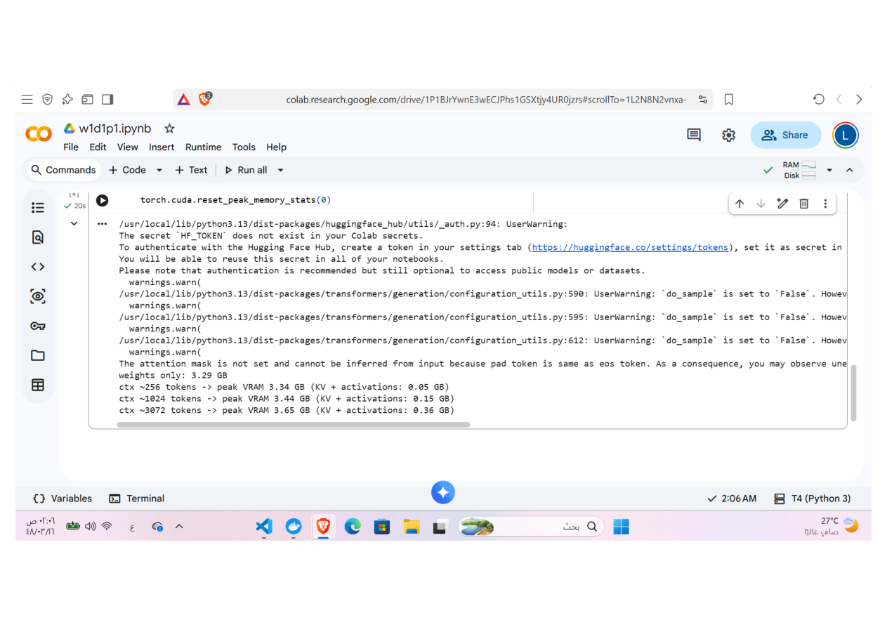
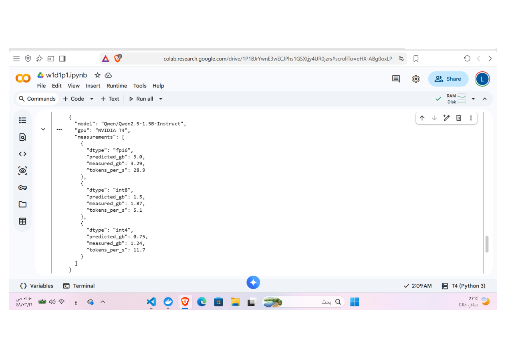

# W2D1: First Contact with GPU Memory

## Objective

This lab investigates how the memory usage of
`Qwen/Qwen2.5-1.5B-Instruct` changes when the model is loaded in fp16, int8,
and int4 precision. It also measures generation throughput and shows how a
longer context increases GPU memory consumption.

The experiment was run in Google Colab on an NVIDIA T4 GPU.

## Prediction

Before running the notebook, I estimated weight memory using:

> Weight memory ≈ parameter count × bytes per parameter

For a 1.5-billion-parameter model:

- **fp16:** 1.5B × 2 bytes = **3.0 GB**
- **int8:** 1.5B × 1 byte = **1.5 GB**
- **int4:** 1.5B × 0.5 bytes = **0.75 GB**
- **Expected runtime overhead:** approximately **1–2 GB**
- **fp32 fit on a 15 GB T4:** **Yes**; its weights require approximately
  6 GB before runtime and context-related allocations.

## 1. GPU Baseline

The Colab runtime reported a Tesla T4 with 15.64 GB of total VRAM. The initial
`nvidia-smi` reading was only 3 MiB, confirming that no previous model tensors
were occupying the card.

## 2. Memory Measurement Helper

The notebook used `torch.cuda.memory_reserved(0)` to measure resident memory.
Before loading another precision, the previous model reference was deleted and
the garbage collector and CUDA cache were cleared.

## 3. fp16 Measurement

The fp16 model load shown below reserved **3.15 GB**, which was also the
increase from the pre-load reading. The final recorded experiment value in
`results.json` is **3.29 GB**. Both readings are above the 3.0 GB weights-only
prediction because CUDA and model runtime allocations add overhead.

## 4. int8 Measurement

Loading the model through the bitsandbytes int8 path used **1.87 GB** of
resident VRAM. This saved substantial memory compared with fp16, but remained
above the theoretical 1.5 GB weight estimate.

## 5. int4 Measurement

The int4 model used **1.24 GB**, the smallest measured footprint. Its observed
memory is greater than the 0.75 GB prediction because quantization metadata,
runtime overhead, and some higher-precision tensors are still required.

## 6. Generation Throughput

Generation was benchmarked with a fixed prompt and 128 new tokens after an
untimed warm-up:

- **fp16:** 28.9 tokens/s
- **int8:** 5.1 tokens/s
- **int4:** 11.7 tokens/s

fp16 was fastest. Quantization reduced memory usage but did not improve speed
on this T4. The int8 and int4 bitsandbytes implementations use different
kernels and dequantize values during generation, which explains why int8 was
slower than int4 in this run.

## 7. Context-Length Memory Growth

With fp16 weights occupying **3.29 GB**, the peak reserved memory increased as
the prompt became longer:

| Approximate context | Peak VRAM | KV cache + activations |
| ---: | ---: | ---: |
| 256 tokens | 3.34 GB | 0.05 GB |
| 1,024 tokens | 3.44 GB | 0.15 GB |
| 3,072 tokens | 3.65 GB | 0.36 GB |

This demonstrates that model weights are not the only part of the serving
memory budget. The KV cache, activations, and allocator workspace grow with the
context length.

## 8. Final Results

Observed bytes per parameter is calculated as measured resident GPU bytes
divided by 1.5 billion parameters.

| dtype | predicted GB | measured GB | observed bytes/param | tokens/s |
| --- | ---: | ---: | ---: | ---: |
| fp16 | 3.00 | 3.29 | 2.19 | 28.9 |
| int8 | 1.50 | 1.87 | 1.25 | 5.1 |
| int4 | 0.75 | 1.24 | 0.83 | 11.7 |

## Conclusion

The measurements confirm that parameter count multiplied by bytes per
parameter is a useful starting estimate, but it is not the complete GPU memory
requirement. Runtime overhead raises every measured value, and its relative
effect is larger for quantized models. Quantization gave a clear memory saving,
while fp16 provided the best generation throughput in this experiment. Longer
contexts also increased peak memory through the KV cache and activations.

## Deliverables

- [`results.json`](results.json): machine-readable measured results
- [`generate.py`](generate.py): generation throughput benchmark
- [`images/`](images/): Colab evidence extracted from the submitted PDF
