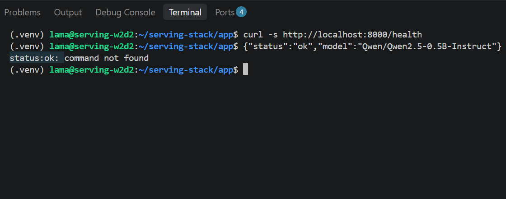
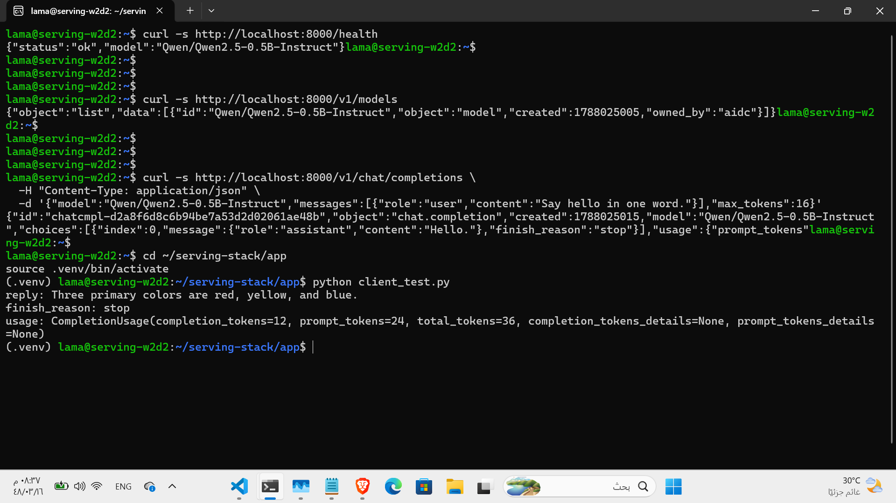
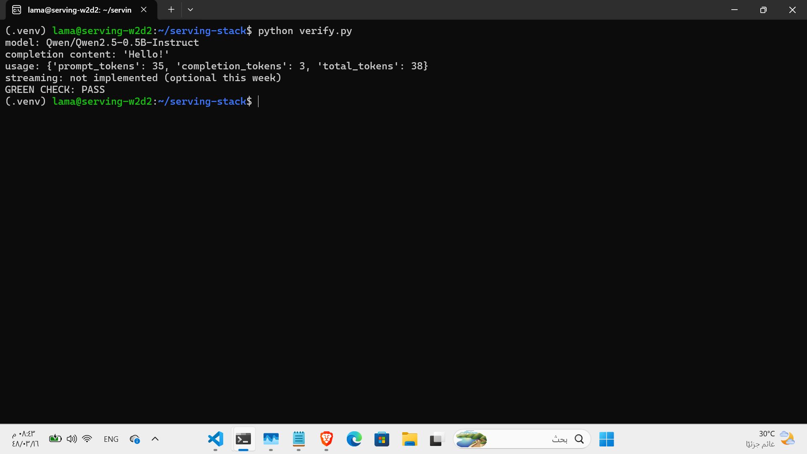
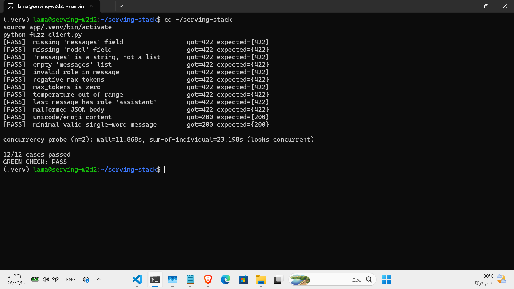

# W2D2 — Wrap the Model

## Objective

Serve `Qwen/Qwen2.5-0.5B-Instruct` on CPU behind an OpenAI-compatible FastAPI
`/v1` API.

## Predictions

- `prompt_tokens`: about 30
- `completion_tokens`: about 32
- Expected first route to pass: `GET /health`
- Expected OpenAI client compatibility: Yes, with only `base_url` changed,
  because the service follows the OpenAI-compatible `/v1` contract.

## Environment and Version Pins

The service runs on CPU only and serves this model:

```text
Qwen/Qwen2.5-0.5B-Instruct
```

`requirements.txt` was pinned according to `PINS.md`:

```text
fastapi==0.115.*
uvicorn[standard]==0.32.*
pydantic==2.9.*
transformers==4.46.*
torch==2.5.*
accelerate==1.1.*
openai==1.54.*
httpx==0.27.*
```

## GET /health

The health endpoint was verified successfully:

```json
{"status":"ok","model":"Qwen/Qwen2.5-0.5B-Instruct"}
```



The `status:ok: command not found` line in the screenshot is not an API
failure. It appeared because the successful JSON response was accidentally
pasted back into the shell as a command.

## GET /v1/models

The models endpoint returned an OpenAI-compatible model list. It was verified
that `data[0].id` equals:

```text
Qwen/Qwen2.5-0.5B-Instruct
```

## POST /v1/chat/completions

A valid non-streaming completion was verified. The example assistant content
was:

```text
Hello.
```

The recorded token usage was:

- `prompt_tokens`: 35
- `completion_tokens`: 3
- `total_tokens`: 38

The accounting is correct because `total_tokens == prompt_tokens +
completion_tokens` (`35 + 3 = 38`).

## OpenAI Python Client Test

`client_test.py` succeeded with the standard OpenAI Python client.

Observed result:

- Reply: `Three primary colors are red, yellow, and blue.`
- `finish_reason`: `stop`
- `prompt_tokens`: 24
- `completion_tokens`: 12
- `total_tokens`: 36

This proves that the standard OpenAI Python client works against the local
server using the configured `base_url`, without requiring changes to the
client's request interface.



## Green Check

The verifier reported:

- Model: `Qwen/Qwen2.5-0.5B-Instruct`
- Completion content: `Hello!`
- Usage: `prompt_tokens=35`, `completion_tokens=3`, `total_tokens=38`
- Streaming: not implemented (optional this week)
- `GREEN CHECK: PASS`



## Known Limitation

Generation blocks the event loop during inference. This is expected in week 2,
and concurrency is intentionally deferred to the week 3 engine.

## Final Result

All required W2D2 Part 1 checks passed. The health, model-list, non-streaming
chat-completions, and OpenAI Python client checks succeeded. Optional streaming
was not implemented.

## Part 2 — Contract Fuzzing

The Extra Lab fuzz suite tested exactly 12 functional cases against the API
contract:

- 10 invalid requests correctly returned HTTP 422.
- 2 unusual but valid requests correctly returned HTTP 200.
- Final result: 12/12 cases passed.
- `GREEN CHECK: PASS`.

The informational concurrency probe produced these observed results:

- `n=2`
- `wall=11.868s`
- `sum-of-individual=23.198s`
- Reported verdict: `looks concurrent`

The concurrency probe is informational only and does not affect the lab's
pass/fail result. No concurrency behavior was changed or corrected as part of
this exercise.


