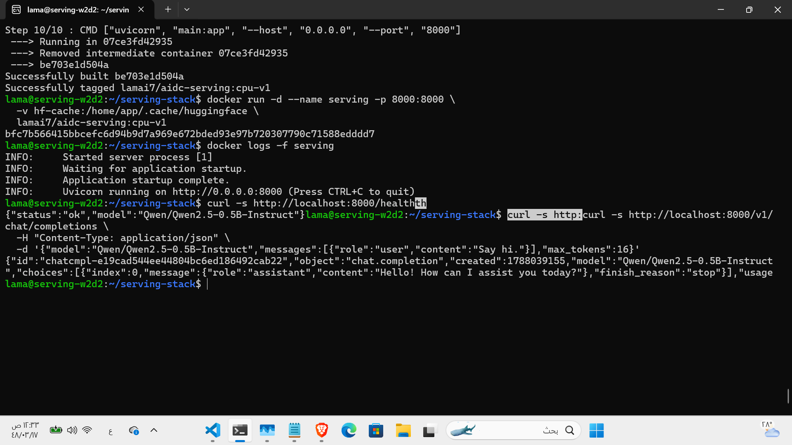
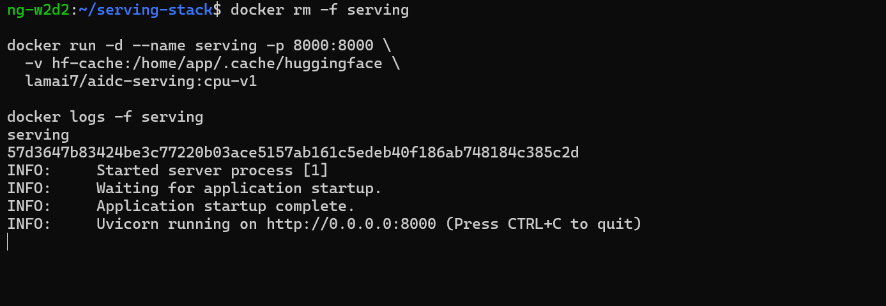
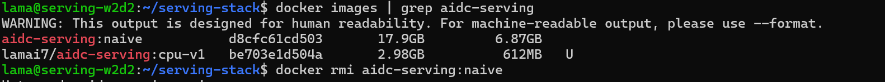
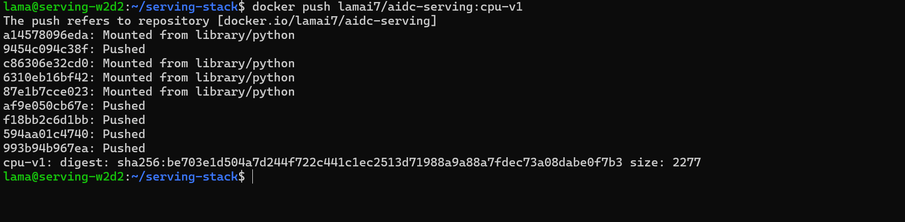
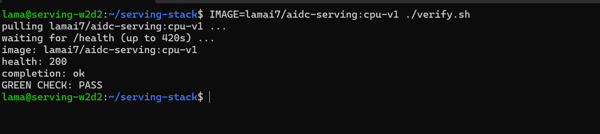
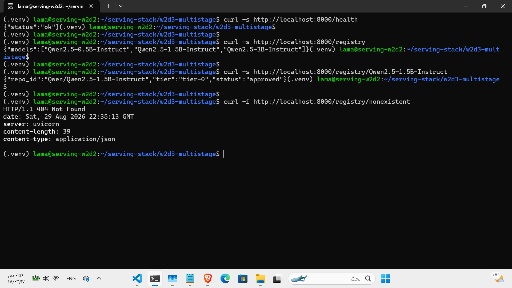
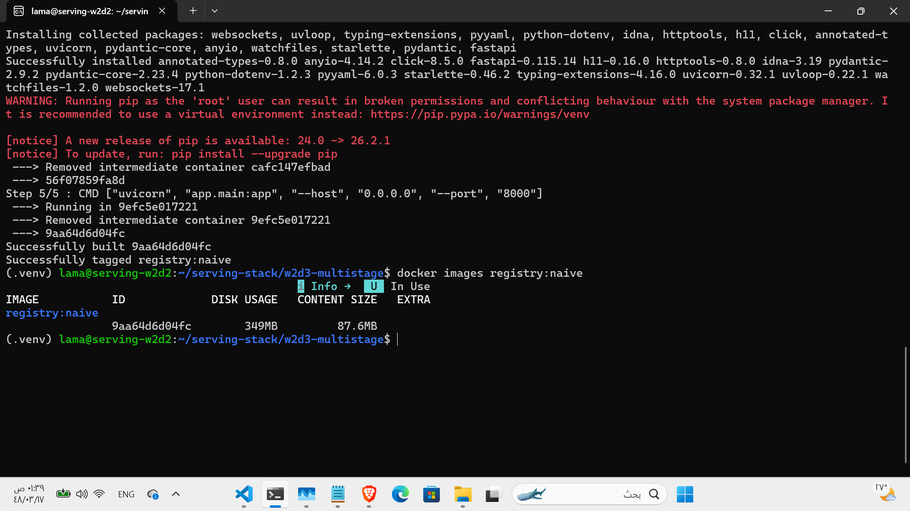
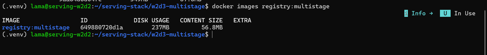
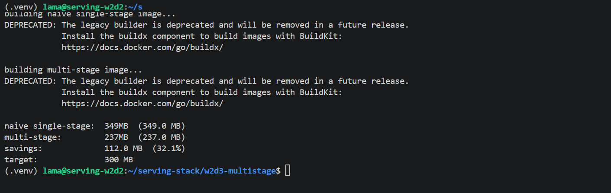
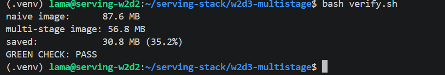

# W2D3 — Containerise

## Part 1 — Containerise

### Docker Image

The service was containerised with `python:3.11-slim`. The Dockerfile copies
and installs the requirements before copying the application code so that
Docker can reuse the dependency layer when only application code changes.
Package installation uses `--no-cache-dir`, and PyTorch is installed from the
CPU wheel index.

The service runs as the non-root `app` user. `HF_HOME` is configured as
`/home/app/.cache/huggingface`; this cache directory is created during the
build and assigned to `app`, allowing the mounted named volume to remain
writable. Uvicorn listens on `0.0.0.0:8000`.

The resulting image started successfully and served both `GET /health` and
`POST /v1/chat/completions`.



### Model Cache Volume

The container was run with a named Hugging Face cache volume:

```bash
docker run -d --name serving -p 8000:8000 \
  -v hf-cache:/home/app/.cache/huggingface \
  lamai7/aidc-serving:cpu-v1
```

The running service successfully answered:

- `GET /health`
- `POST /v1/chat/completions`

The container was then removed and recreated using the same `hf-cache` named
volume. The second startup reused the cached model and did not download it
again.



### Naive vs Slim Measurement

| stage                               |         image size |
| ----------------------------------- | -----------------: |
| naive build (full base, cached pip) |            17.9 GB |
| slim CPU build                      |            2.98 GB |
| measured reduction                  | 14.92 GB (\~83.4%) |

The measured gap was unusually large because the naive build installed
PyTorch from the default package source and included CUDA/Triton-related
dependencies. The final Dockerfile explicitly used the PyTorch CPU wheel
index. Its other slimming choices were `python:3.11-slim`, pip's
`--no-cache-dir`, and `.dockerignore`.



### Docker Hub

The final image was pushed successfully as:

```text
lamai7/aidc-serving:cpu-v1
```

The completed push returned a `sha256` digest.



### Verification

Final verification used:

```bash
IMAGE=lamai7/aidc-serving:cpu-v1 ./verify.sh
```

The important verifier output was:

```text
pulling lamai7/aidc-serving:cpu-v1 ...
health: 200
completion: ok
GREEN CHECK: PASS
```

The verifier performed a fresh registry pull. This proves that the published
image works, rather than verifying only the locally built copy.



## Extra Lab — Multi-stage Build Golf

### Registry Service

A standalone lightweight FastAPI model-registry service was created under
`w2d3-multistage/`. It uses only these dependencies:

```text
fastapi==0.115.*
uvicorn[standard]==0.32.*
pydantic==2.9.*
```

Local testing succeeded for all required routes:

- `GET /health`
- `GET /registry`
- `GET /registry/Qwen2.5-1.5B-Instruct`
- `GET /registry/nonexistent` returned HTTP 404



### Naive Build

The single-stage image was built as `registry:naive`. Docker reported:

- Disk usage: **349 MB**
- Content size: **87.6 MB**

The naive Dockerfile copies the entire build context before installing the
dependencies.



### Multi-stage Build

The optimized image was built as `registry:multistage`. Docker reported:

- Disk usage: **237 MB**
- Content size: **56.8 MB**

The builder installs dependencies with `--prefix=/install/deps`. The runtime
stage copies only:

- `/install/deps` to `/usr/local`
- `app/main.py`
- `app/registry.json`

The resulting image is below the 300 MB target.



### Size Report

`report_sizes.sh` produced:

```text
naive single-stage: 349 MB
multi-stage:        237 MB
savings:            112 MB (32.1%)
target:             300 MB
```

The generated `size_report.json` contained:

```json
{
  "naive_mb": 349.0,
  "multistage_mb": 237.0,
  "savings_mb": 112.0,
  "savings_pct": 32.1,
  "target_mb": 300.0,
  "fits_target": true
}
```



### Final Verifier

The final verifier reported exactly:

```text
naive image:       87.6 MB
multi-stage image: 56.8 MB
saved:             30.8 MB (35.2%)
GREEN CHECK: PASS
```

The apparent difference between the 349/237 MB values and the 87.6/56.8 MB
values comes from different Docker size measurements and display metrics. Both
sets of measurements demonstrate the same successful reduction.



### Conclusion

The multi-stage build:

- Stayed below the 300 MB target.
- Achieved more than 20% savings.
- Retained all required registry functionality.
- Passed the final green check.

## Part 3 — Bug Lab: The Rebuild That Never Gets Faster

### Reproduce

The intentionally broken Dockerfile used:

```dockerfile
FROM python:3.11-slim
WORKDIR /app
COPY . .
RUN pip install --no-cache-dir -r app/requirements.txt
CMD ["uvicorn", "app.main:app", "--host", "0.0.0.0", "--port", "8000"]
```

After a comment-only change to `app/main.py`, `svc:v2` rebuilt the dependency
layer. `docker history svc:v2` showed:

```text
48a651cf85f4   12 seconds ago   /bin/sh -c pip install --no-cache-dir -r app…   51.5MB
00b11e0243fc   22 seconds ago   /bin/sh -c #(nop) COPY dir:0179572899395abef…   24.6kB
```

`COPY . .` included `app/main.py`. Changing that file invalidated the `COPY`
layer, which also invalidated the following pip-install layer even though
`requirements.txt` had not changed.

### Fix

The Dockerfile was reordered to:

```dockerfile
FROM python:3.11-slim
WORKDIR /app
COPY app/requirements.txt .
RUN pip install --no-cache-dir -r requirements.txt
COPY app/ .
CMD ["uvicorn", "main:app", "--host", "0.0.0.0", "--port", "8000"]
```

Dependencies now have their own stable cache layer before the application code
is copied.

### Verification

After building `svc:v3`, another comment-only edit was made to `app/main.py`
and `svc:v4` was built. The output was:

```text
Step 2/6 : WORKDIR /app
---> Using cache
Step 3/6 : COPY app/requirements.txt .
---> Using cache
Step 4/6 : RUN pip install --no-cache-dir -r requirements.txt
---> Using cache
Step 5/6 : COPY app/ .
---> 7b9e1584baee

Successfully built 9f16f7a54d6f
Successfully tagged svc:v4

real    0m1.917s
user    0m0.011s
sys     0m0.022s
```

`docker history svc:v4` showed the reused dependency layer:

```text
b0b67eb073be   About a minute ago   /bin/sh -c pip install --no-cache-dir -r req…   51.5MB
```

### Conclusion

- The bug was Docker layer ordering, not pip or `requirements.txt`.
- `COPY . .` before pip install caused code edits to invalidate the dependency
  layer.
- Copying `requirements.txt` first isolated dependency installation from code
  changes.
- After the fix, pip install was reused from cache.
- The code-only rebuild completed in 1.917 seconds.
